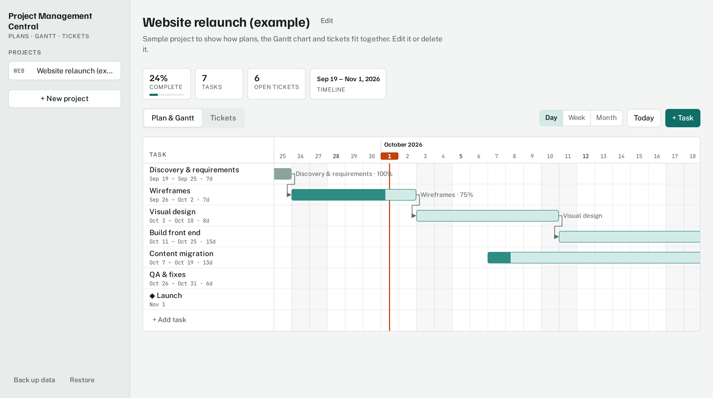
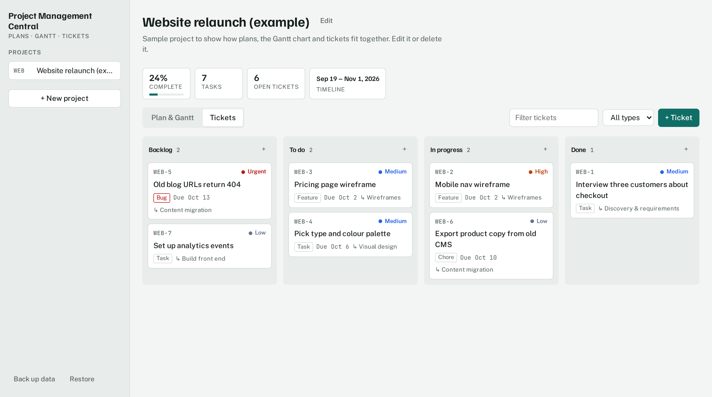

# Project Management Central

A personal project planner with a Gantt chart and a ticket board, built as a single page that runs entirely in the browser.

**[Live demo](https://auriumzero.github.io/project-management-central/)**: it opens with a sample project, so you can try it right away.

## Features

- **Projects.** Keep several projects, each with its own plan, tickets and ticket prefix (e.g. `WEB-12`).
- **Gantt chart.** Drag a bar to reschedule a task, or drag either edge to change its length. It shows dependency arrows, milestones, a today marker, and day, week and month zoom.
- **Ticket board.** Four columns (Backlog, To do, In progress, Done) with drag and drop. Tickets have a priority, a type, a due date with an overdue flag, and an optional link to a task in the plan. You can filter by text or by type.
- **Progress at a glance.** Project completion is weighted by task duration, alongside an open-ticket count and the overall timeline.
- **Backup and restore.** Export everything to a JSON file and import it on another machine.
- **Light and dark themes.** It follows your system setting and works at phone width.

## How it's built

- One `index.html` file with plain HTML, CSS and JavaScript: no framework, no build step, no dependencies.
- State is a single JSON object saved in `localStorage`. Dates are stored as `YYYY-MM-DD` and calculated as whole UTC days, so durations don't shift across daylight-saving changes.
- The Gantt chart is DOM and SVG drawn from that state. One scroll container with sticky headers keeps the task list and the timeline aligned. Dragging uses Pointer Events, so it works with a mouse or a finger.
- Data stays in your browser and is never sent to a server.

## Run it locally

Open `index.html` in any modern browser. That's it.

## Roadmap

- Rewrite in React and TypeScript with unit tests for the scheduling logic
- Optional cloud sync so the same data shows up on every device
- Critical path highlighting and automatic rescheduling of dependent tasks
